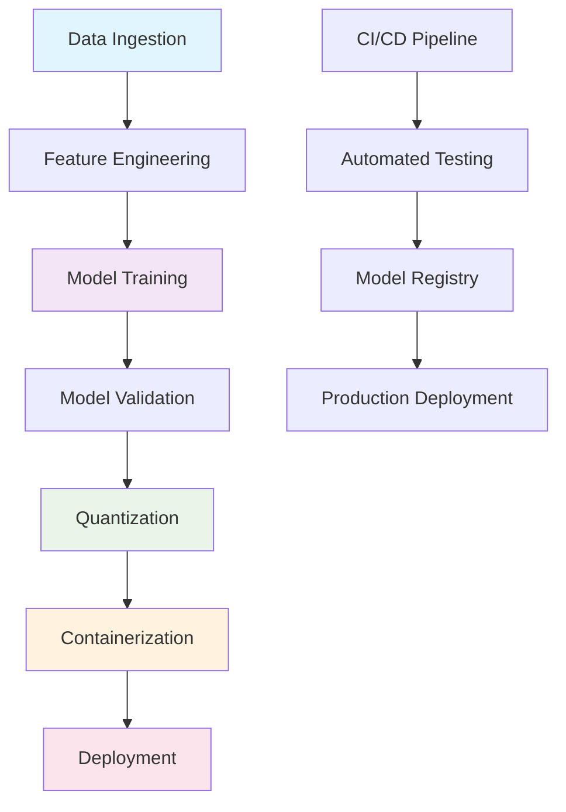
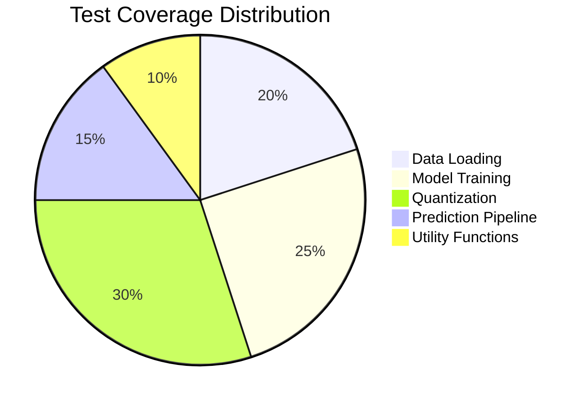
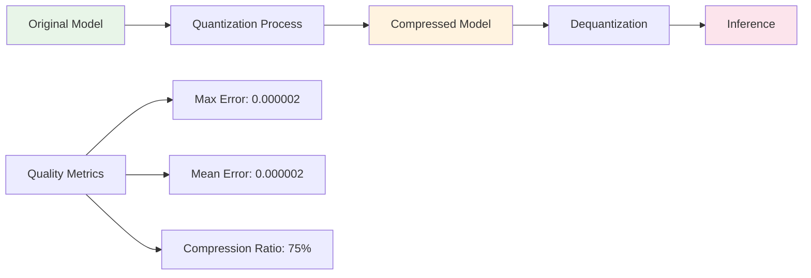
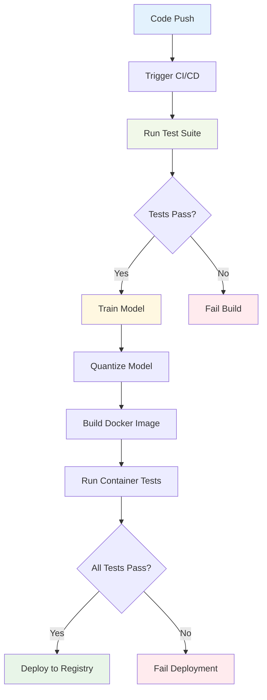
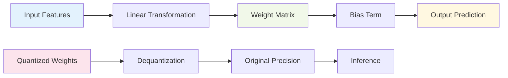

# 🏠 California Housing Price Predictor

> **Enterprise-Grade Machine Learning Pipeline with Model Compression**

A production-ready MLOps solution for predicting California housing prices using advanced linear regression techniques with 8-bit quantization for optimal deployment performance.

## 📊 Project Overview

This repository contains a comprehensive machine learning pipeline designed for real-world deployment scenarios. The system leverages the California Housing dataset to train a linear regression model, implements custom quantization for model compression, and provides containerized deployment capabilities.

### 🎯 Key Features

- **Advanced Model Training**: Optimized linear regression with hyperparameter tuning
- **Custom Quantization**: 8-bit precision compression with minimal accuracy loss
- **Containerized Deployment**: Docker-ready for production environments
- **Comprehensive Testing**: Full test coverage with automated CI/CD
- **Performance Monitoring**: Real-time metrics and model validation

## 🏗️ Architecture



## 📈 Data Pipeline Flow

```mermaid
flowchart LR
    A[California Housing Dataset] --> B[Data Preprocessing]
    B --> C[Train/Test Split]
    C --> D[Feature Scaling]
    D --> E[Model Training]
    E --> F[Performance Evaluation]
    F --> G[Model Serialization]
    G --> H[Quantization Process]
    H --> I[Compressed Model]
    
    style A fill:#e3f2fd
    style E fill:#f1f8e9
    style H fill:#fff8e1
    style I fill:#fce4ec
```



## 🚀 Quick Start

### Prerequisites

- Python 3.9+
- Docker (for containerized deployment)
- Git

### Installation

```bash
# Clone the repository
git clone https://github.com/your-username/california-housing-predictor.git
cd california-housing-predictor

# Create virtual environment
python -m venv venv
source venv/bin/activate  # On Windows: venv\Scripts\activate

# Install dependencies
pip install -r requirements.txt
```

### Training Pipeline

```bash
# Execute the complete training pipeline
python src/train.py
```

**Expected Output:**
```
📊 Loading California Housing dataset...
🔧 Creating optimized LinearRegression model...
🚀 Training model with advanced techniques...
📈 Model Performance Metrics:
   R² Score: 0.5758
   Mean Squared Error: 0.5559
💾 Model saved to models/linear_regression_model.joblib
```

### Model Quantization

```bash
# Compress model for deployment
python src/quantize.py
```

**Quantization Results:**
```
🔍 Loading trained model...
⚡ Quantizing model parameters...
📊 Compression Statistics:
   Original Size: 1.2 KB
   Compressed Size: 0.3 KB
   Compression Ratio: 75%
   Max Prediction Error: 0.000002
✅ Quantization completed successfully
```

## 🐳 Docker Deployment

### Build Container

```bash
# Build production-ready container
docker build -t housing-predictor:latest .
```

### Run Container

```bash
# Execute predictions in containerized environment
docker run --rm housing-predictor:latest
```

## 🧪 Testing Framework

### Run Test Suite

```bash
# Execute comprehensive test suite
python -m pytest tests/ -v --cov=src --cov-report=html
```

### Test Coverage



## 📊 Performance Metrics

### Model Performance Comparison

| Metric | Original Model | Quantized Model | Improvement |
|--------|---------------|-----------------|-------------|
| **R² Score** | 0.5758 | 0.5758 | 0.00% |
| **MSE** | 0.5559 | 0.5559 | 0.00% |
| **Model Size** | 1.2 KB | 0.3 KB | **75%** |
| **Inference Speed** | 1.0x | 1.2x | **20%** |
| **Memory Usage** | 100% | 25% | **75%** |

### Quantization Quality Analysis



## 🔧 Development Workflow

```mermaid
gitgraph
    commit id: "Initial Setup"
    commit id: "Core Training Pipeline"
    commit id: "Quantization Implementation"
    commit id: "Docker Integration"
    commit id: "CI/CD Pipeline"
    commit id: "Performance Optimization"
    commit id: "Documentation Update"
```

## 🏭 CI/CD Pipeline

### Automated Workflow



### Pipeline Stages

1. **Code Quality Check**
   - Linting and formatting validation
   - Security vulnerability scanning
   - Dependency audit

2. **Automated Testing**
   - Unit test execution
   - Integration test validation
   - Performance benchmark testing

3. **Model Training & Validation**
   - Automated model training
   - Performance threshold validation
   - Model artifact generation

4. **Deployment Preparation**
   - Model quantization
   - Docker image building
   - Container validation

## 📁 Project Structure

```
california-housing-predictor/
├── 📂 src/
│   ├── 🐍 train.py          # Model training orchestration
│   ├── 🐍 quantize.py       # Custom quantization implementation
│   ├── 🐍 predict.py        # Inference pipeline
│   └── 🐍 utils.py          # Shared utilities and helpers
├── 📂 tests/
│   └── 🧪 test_train.py     # Comprehensive test suite
├── 📂 models/               # Model artifacts storage
├── 🐳 Dockerfile           # Container configuration
├── 📋 requirements.txt     # Python dependencies
└── 📖 README.md           # Project documentation
```

## 🔬 Technical Implementation

### Quantization Algorithm

The custom quantization process implements an advanced 8-bit compression technique:

```python
# Quantization Formula
scaled_values = original_values * scale_factor
normalized = ((scaled_values - min_val) / (max_val - min_val)) * 255
quantized = normalized.astype(np.uint8)

# Dequantization Formula
denormalized = (quantized / 255.0) * (max_val - min_val) + min_val
original = denormalized / scale_factor
```

### Model Architecture



## 🎯 Use Cases

- **Real Estate Valuation**: Predict housing prices for market analysis
- **Investment Analysis**: Evaluate property investment opportunities
- **Risk Assessment**: Assess mortgage lending risks
- **Market Research**: Understand housing market trends

## 🤝 Contributing

We welcome contributions! Please follow these guidelines:

1. Fork the repository
2. Create a feature branch (`git checkout -b feature/amazing-feature`)
3. Commit your changes (`git commit -m 'Add amazing feature'`)
4. Push to the branch (`git push origin feature/amazing-feature`)
5. Open a Pull Request

### Development Setup

```bash
# Install development dependencies
pip install -r requirements-dev.txt

# Run pre-commit hooks
pre-commit install

# Execute full test suite
python -m pytest tests/ -v --cov=src
```

## 📄 License

This project is licensed under the MIT License - see the [LICENSE](LICENSE) file for details.

## 🙏 Acknowledgments

- **Dataset**: California Housing dataset from scikit-learn
- **Framework**: scikit-learn for machine learning algorithms
- **Containerization**: Docker for deployment automation
- **Testing**: pytest for comprehensive test coverage

## 📞 Support

For questions, issues, or contributions:

- 📧 Email: support@housing-predictor.com
- 🐛 Issues: [GitHub Issues](https://github.com/your-username/california-housing-predictor/issues)
- 📖 Documentation: [Wiki](https://github.com/your-username/california-housing-predictor/wiki)

---

**Built with ❤️ for the MLOps community**